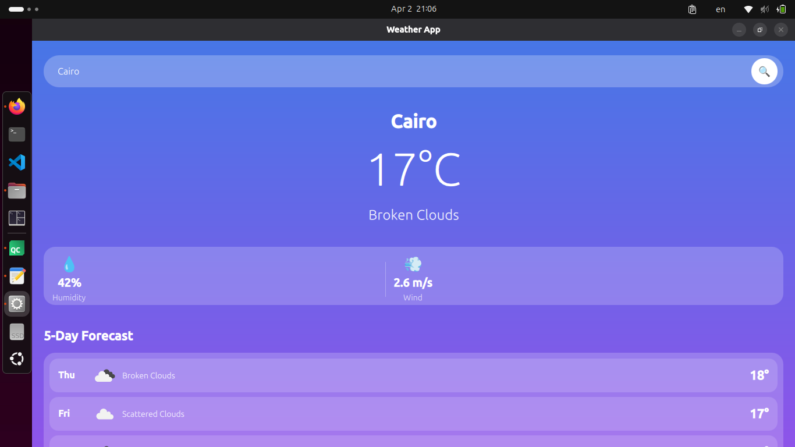
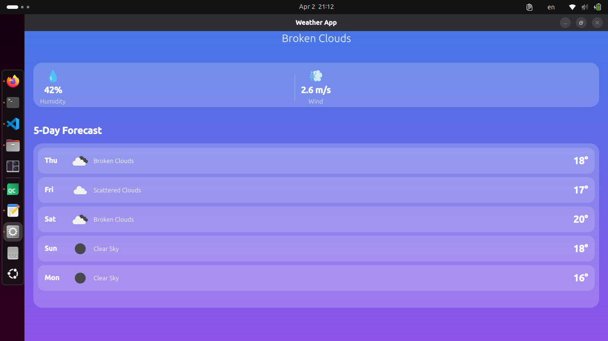

# 🌤️ Weather App - Qt/QML

A modern, professional weather application built with Qt 6, QML, and C++. The app fetches real-time weather data and 5-day forecasts from OpenWeatherMap API.

---

##  Screenshots


## ✨ Features

- 🔍 Search for any city worldwide
- 🌡️ Real-time temperature display
- 💧 Humidity percentage
- 💨 Wind speed
- 🎨 Beautiful gradient UI design
- 📅 5-day weather forecast
- 🖼️ Dynamic weather icons
- 📱 Responsive design
- ⌨️ Enter key support for search

---

## 🛠️ Technologies Used

| Technology | Purpose |
|------------|---------|
| **Qt 6** | Framework |
| **QML** | User Interface |
| **C++** | Backend Logic |
| **OpenWeatherMap API** | Weather Data |
| **JSON** | Data Parsing |
| **CMake** | Build System |

---

## 📁 Project Structure

```
WeatherApp/
├── CMakeLists.txt          # Build configuration
├── main.cpp                # Application entry point
├── WeatherAPI.h            # Weather API class header
├── WeatherAPI.cpp          # Weather API implementation
├── Main.qml                # Main UI file
└── README.md               # Documentation
```

---

## 📋 Prerequisites

- Qt 6.0 or higher
- Qt Creator (recommended)
- C++17 compiler
- Internet connection
- OpenWeatherMap API key (free)

---

## 🚀 Installation

### Step 1: Clone the repository

```bash
git clone https://github.com/yourusername/WeatherApp.git
cd WeatherApp
```

### Step 2: Get API Key

1. Go to [OpenWeatherMap](https://openweathermap.org/)
2. Create a free account
3. Go to API Keys section
4. Copy your API key

### Step 3: Configure API Key

Open `WeatherAPI.h` and replace the API key:

```cpp
QString apiKey = "YOUR_API_KEY_HERE";
```

### Step 4: Build the project

**Using Qt Creator:**
1. Open `CMakeLists.txt` in Qt Creator
2. Configure the project
3. Build and Run (Ctrl + R)

**Using Command Line:**
```bash
mkdir build
cd build
cmake ..
make
./WeatherApp
```

---

## 📝 Code Documentation

### WeatherAPI.h

```cpp
#ifndef WEATHERAPI_H
#define WEATHERAPI_H

#include <QObject>
#include <QString>
#include <QNetworkAccessManager>
#include <QNetworkReply>
#include <QVariantList>

class WeatherAPI : public QObject {
    Q_OBJECT

    // Properties accessible from QML
    Q_PROPERTY(QString cityName READ getCityName NOTIFY weatherDataReady)
    Q_PROPERTY(QString weather READ getWeather NOTIFY weatherDataReady)
    Q_PROPERTY(int humidity READ getHumidity NOTIFY weatherDataReady)
    Q_PROPERTY(double temperature READ getTemperature NOTIFY weatherDataReady)
    Q_PROPERTY(QString icon READ getIcon NOTIFY weatherDataReady)
    Q_PROPERTY(double windSpeed READ getWindSpeed NOTIFY weatherDataReady)
    Q_PROPERTY(QVariantList forecast READ getForecast NOTIFY forecastReady)

private:
    QNetworkAccessManager* manager;     // Handles HTTP requests
    QString apiKey = "YOUR_API_KEY";    // OpenWeatherMap API key
    QString currentCity;                 // Current searched city
    QString currentRequestType;          // "weather" or "forecast"

    // Weather data storage
    QString city_name;
    QString weather;
    int humidity;
    double temperature;
    QString icon;
    double windSpeed;
    QVariantList forecastList;

public:
    explicit WeatherAPI(QObject* parent = nullptr);

    // Functions callable from QML
    Q_INVOKABLE void fetchWeather(QString cityName);
    Q_INVOKABLE void fetchForecast(QString cityName);

    // Getter functions
    QString getCityName();
    QString getWeather();
    int getHumidity();
    double getTemperature();
    QString getIcon();
    double getWindSpeed();
    QVariantList getForecast();

private slots:
    void handleNetworkReply(QNetworkReply* reply);
    void onWeatherDataReceived(QNetworkReply* reply);
    void onForecastReceived(QNetworkReply* reply);

signals:
    void weatherDataReady();              // Emitted when weather data is loaded
    void forecastReady();                 // Emitted when forecast is loaded
    void errorOccurred(QString message);  // Emitted on error
};

#endif
```

---

### WeatherAPI.cpp

```cpp
#include "WeatherAPI.h"
#include <QNetworkRequest>
#include <QUrl>
#include <QJsonDocument>
#include <QJsonObject>
#include <QJsonArray>
#include <QDebug>
#include <QDateTime>

// Constructor - initializes network manager and connects signal
WeatherAPI::WeatherAPI(QObject* parent) : QObject(parent) {
    manager = new QNetworkAccessManager(this);
    
    // Connect network reply to handler
    connect(manager, &QNetworkAccessManager::finished, 
            this, &WeatherAPI::handleNetworkReply);
}

// Fetch current weather for a city
void WeatherAPI::fetchWeather(QString cityName) {
    currentCity = cityName;
    currentRequestType = "weather";
    
    // Build API URL
    QString url = "https://api.openweathermap.org/data/2.5/weather?q=" 
                + cityName 
                + "&appid=" + apiKey 
                + "&units=metric";
    
    // Create and send request
    QUrl qurl(url);
    QNetworkRequest request(qurl);
    manager->get(request);
}

// Fetch 5-day forecast for a city
void WeatherAPI::fetchForecast(QString cityName) {
    currentRequestType = "forecast";
    
    // Build API URL
    QString url = "https://api.openweathermap.org/data/2.5/forecast?q=" 
                + cityName 
                + "&appid=" + apiKey 
                + "&units=metric";
    
    // Create and send request
    QUrl qurl(url);
    QNetworkRequest request(qurl);
    manager->get(request);
}

// Handle network reply - route to appropriate handler
void WeatherAPI::handleNetworkReply(QNetworkReply* reply) {
    // Check for errors
    if (reply->error()) {
        qDebug() << "Error:" << reply->errorString();
        emit errorOccurred(reply->errorString());
        reply->deleteLater();
        return;
    }
    
    // Route to appropriate handler
    if (currentRequestType == "weather") {
        onWeatherDataReceived(reply);
    } else if (currentRequestType == "forecast") {
        onForecastReceived(reply);
    }
}

// Process current weather data
void WeatherAPI::onWeatherDataReceived(QNetworkReply* reply) {
    // Read response data
    QByteArray data = reply->readAll();
    
    // Parse JSON
    QJsonDocument doc = QJsonDocument::fromJson(data);
    QJsonObject json = doc.object();

    // Extract city name
    city_name = json.value("name").toString();
    
    // Extract main weather data
    QJsonObject main = json.value("main").toObject();
    temperature = main.value("temp").toDouble();
    humidity = main.value("humidity").toInt();

    // Extract wind data
    QJsonObject wind = json.value("wind").toObject();
    windSpeed = wind.value("speed").toDouble();

    // Extract weather description and icon
    QJsonArray weatherArray = json.value("weather").toArray();
    QJsonObject weatherObj = weatherArray.at(0).toObject();
    weather = weatherObj.value("description").toString();
    icon = weatherObj.value("icon").toString();

    qDebug() << "Weather loaded:" << city_name << temperature << weather;

    // Notify QML that data is ready
    emit weatherDataReady();
    reply->deleteLater();
    
    // Automatically fetch forecast
    fetchForecast(currentCity);
}

// Process 5-day forecast data
void WeatherAPI::onForecastReceived(QNetworkReply* reply) {
    // Read response data
    QByteArray data = reply->readAll();
    
    // Parse JSON
    QJsonDocument doc = QJsonDocument::fromJson(data);
    QJsonObject json = doc.object();

    // Clear previous forecast
    forecastList.clear();

    // Get forecast list
    QJsonArray list = json.value("list").toArray();
    
    QString lastDate = "";
    
    // Process each forecast item
    for (int i = 0; i < list.size(); i++) {
        QJsonObject item = list.at(i).toObject();
        
        QString dateTime = item.value("dt_txt").toString();
        QString date = dateTime.split(" ").at(0);
        
        // Get one forecast per day
        if (date != lastDate) {
            lastDate = date;
            
            // Extract forecast data
            QJsonObject main = item.value("main").toObject();
            QJsonArray weatherArray = item.value("weather").toArray();
            QJsonObject weatherObj = weatherArray.at(0).toObject();
            
            // Create forecast map
            QVariantMap dayForecast;
            dayForecast["date"] = date;
            dayForecast["temp"] = main.value("temp").toDouble();
            dayForecast["icon"] = weatherObj.value("icon").toString();
            dayForecast["weather"] = weatherObj.value("description").toString();
            
            // Get day name (Mon, Tue, etc.)
            QDateTime dt = QDateTime::fromString(dateTime, "yyyy-MM-dd hh:mm:ss");
            dayForecast["dayName"] = dt.toString("ddd");
            
            forecastList.append(dayForecast);
            
            qDebug() << "Forecast day:" << dayForecast["dayName"] << dayForecast["temp"];
        }
        
        // Limit to 5 days
        if (forecastList.size() >= 5) break;
    }

    qDebug() << "Forecast loaded, days:" << forecastList.size();
    
    // Notify QML that forecast is ready
    emit forecastReady();
    reply->deleteLater();
}

// Getter functions
QString WeatherAPI::getCityName() { return city_name; }
QString WeatherAPI::getWeather() { return weather; }
int WeatherAPI::getHumidity() { return humidity; }
double WeatherAPI::getTemperature() { return temperature; }
QString WeatherAPI::getIcon() { return icon; }
double WeatherAPI::getWindSpeed() { return windSpeed; }
QVariantList WeatherAPI::getForecast() { return forecastList; }
```

---

### main.cpp

```cpp
#include <QGuiApplication>
#include <QQmlApplicationEngine>
#include <QtQml>
#include "WeatherAPI.h"

int main(int argc, char *argv[])
{
    QGuiApplication app(argc, argv);

    QQmlApplicationEngine engine;
    
    // Handle QML loading errors
    QObject::connect(
        &engine,
        &QQmlApplicationEngine::objectCreationFailed,
        &app,
        []() { QCoreApplication::exit(-1); },
        Qt::QueuedConnection);
    
    // Register WeatherAPI for use in QML
    qmlRegisterType<WeatherAPI>("com.weather", 1, 0, "WeatherAPI");
    
    // Load main QML file
    engine.loadFromModule("weatherapp", "Main");

    return app.exec();
}
```

---

### Main.qml

```qml
import QtQuick
import QtQuick.Window
import QtQuick.Controls
import QtQuick.Layouts
import com.weather 1.0

Window {
    id: root
    width: 420
    height: 800
    visible: true
    title: "Weather App"
    minimumWidth: 350
    minimumHeight: 600

    // Create WeatherAPI instance
    WeatherAPI {
        id: weatherApi
    }

    // Connect to signals
    Connections {
        target: weatherApi
        function onForecastReady() {
            forecastList.model = weatherApi.forecast
        }
    }

    // Background gradient
    Rectangle {
        anchors.fill: parent
        gradient: Gradient {
            GradientStop { position: 0.0; color: "#4776E6" }
            GradientStop { position: 1.0; color: "#8E54E9" }
        }
    }

    // Scrollable content
    Flickable {
        anchors.fill: parent
        contentHeight: mainColumn.height + 40
        clip: true

        ColumnLayout {
            id: mainColumn
            width: parent.width
            anchors.horizontalCenter: parent.horizontalCenter
            anchors.margins: 20
            spacing: 15

            Item { height: 10 }

            // Search Bar
            Rectangle {
                Layout.fillWidth: true
                Layout.leftMargin: 20
                Layout.rightMargin: 20
                height: 55
                radius: 27
                color: Qt.rgba(255, 255, 255, 0.25)

                RowLayout {
                    anchors.fill: parent
                    anchors.leftMargin: 20
                    anchors.rightMargin: 10
                    spacing: 10

                    TextField {
                        id: searchField
                        Layout.fillWidth: true
                        placeholderText: "Enter city name..."
                        placeholderTextColor: Qt.rgba(1, 1, 1, 0.6)
                        color: "white"
                        font.pixelSize: 16
                        background: Rectangle { color: "transparent" }
                        
                        Keys.onReturnPressed: {
                            if (text !== "") {
                                weatherApi.fetchWeather(text)
                            }
                        }
                    }

                    Rectangle {
                        width: 45
                        height: 45
                        radius: 22
                        color: "white"
                        
                        Text {
                            anchors.centerIn: parent
                            text: "🔍"
                            font.pixelSize: 20
                        }
                        
                        MouseArea {
                            anchors.fill: parent
                            cursorShape: Qt.PointingHandCursor
                            onClicked: {
                                if (searchField.text !== "") {
                                    weatherApi.fetchWeather(searchField.text)
                                }
                            }
                        }
                    }
                }
            }

            Item { height: 10 }

            // City Name
            Text {
                Layout.alignment: Qt.AlignHCenter
                text: weatherApi.cityName || "Search for a city"
                font.pixelSize: 32
                font.bold: true
                color: "white"
            }

            // Weather Icon
            Image {
                Layout.alignment: Qt.AlignHCenter
                source: weatherApi.icon ? 
                    "https://openweathermap.org/img/wn/" + weatherApi.icon + "@4x.png" : ""
                Layout.preferredWidth: 150
                Layout.preferredHeight: 150
                fillMode: Image.PreserveAspectFit
                visible: weatherApi.icon ? true : false
            }

            // Temperature
            Text {
                Layout.alignment: Qt.AlignHCenter
                text: weatherApi.temperature ? 
                    Math.round(weatherApi.temperature) + "°C" : "--°C"
                font.pixelSize: 80
                font.weight: Font.Light
                color: "white"
            }

            // Weather Description
            Text {
                Layout.alignment: Qt.AlignHCenter
                text: weatherApi.weather || ""
                font.pixelSize: 24
                color: Qt.rgba(1, 1, 1, 0.9)
                font.capitalization: Font.Capitalize
                visible: weatherApi.weather ? true : false
            }

            Item { height: 10 }

            // Weather Details Box
            Rectangle {
                Layout.fillWidth: true
                Layout.leftMargin: 20
                Layout.rightMargin: 20
                height: 100
                radius: 20
                color: Qt.rgba(255, 255, 255, 0.2)
                visible: weatherApi.cityName ? true : false

                RowLayout {
                    anchors.fill: parent
                    anchors.margins: 15

                    // Humidity
                    ColumnLayout {
                        Layout.fillWidth: true
                        spacing: 5
                        
                        Text {
                            Layout.alignment: Qt.AlignHCenter
                            text: "💧"
                            font.pixelSize: 30
                        }
                        Text {
                            Layout.alignment: Qt.AlignHCenter
                            text: weatherApi.humidity + "%"
                            font.pixelSize: 20
                            font.bold: true
                            color: "white"
                        }
                        Text {
                            Layout.alignment: Qt.AlignHCenter
                            text: "Humidity"
                            font.pixelSize: 14
                            color: Qt.rgba(1, 1, 1, 0.7)
                        }
                    }

                    // Separator
                    Rectangle {
                        width: 1
                        height: 60
                        color: Qt.rgba(1, 1, 1, 0.3)
                    }

                    // Wind Speed
                    ColumnLayout {
                        Layout.fillWidth: true
                        spacing: 5
                        
                        Text {
                            Layout.alignment: Qt.AlignHCenter
                            text: "💨"
                            font.pixelSize: 30
                        }
                        Text {
                            Layout.alignment: Qt.AlignHCenter
                            text: weatherApi.windSpeed ? 
                                weatherApi.windSpeed.toFixed(1) + " m/s" : "-- m/s"
                            font.pixelSize: 20
                            font.bold: true
                            color: "white"
                        }
                        Text {
                            Layout.alignment: Qt.AlignHCenter
                            text: "Wind"
                            font.pixelSize: 14
                            color: Qt.rgba(1, 1, 1, 0.7)
                        }
                    }
                }
            }

            Item { height: 10 }

            // Forecast Title
            Text {
                Layout.leftMargin: 20
                text: "5-Day Forecast"
                font.pixelSize: 22
                font.bold: true
                color: "white"
                visible: forecastList.count > 0
            }

            // Forecast List
            Rectangle {
                Layout.fillWidth: true
                Layout.leftMargin: 20
                Layout.rightMargin: 20
                height: forecastList.count * 70 + 20
                radius: 20
                color: Qt.rgba(255, 255, 255, 0.2)
                visible: forecastList.count > 0

                ListView {
                    id: forecastList
                    anchors.fill: parent
                    anchors.margins: 10
                    spacing: 8
                    clip: true
                    interactive: false
                    model: []

                    delegate: Rectangle {
                        width: forecastList.width
                        height: 58
                        radius: 15
                        color: Qt.rgba(255, 255, 255, 0.15)

                        RowLayout {
                            anchors.fill: parent
                            anchors.leftMargin: 15
                            anchors.rightMargin: 15

                            // Day name
                            Text {
                                Layout.preferredWidth: 50
                                text: modelData.dayName || ""
                                font.pixelSize: 16
                                font.bold: true
                                color: "white"
                            }

                            // Weather icon
                            Image {
                                Layout.preferredWidth: 50
                                Layout.preferredHeight: 50
                                source: modelData.icon ? 
                                    "https://openweathermap.org/img/wn/" + modelData.icon + "@2x.png" : ""
                                fillMode: Image.PreserveAspectFit
                            }

                            // Weather description
                            Text {
                                Layout.fillWidth: true
                                text: modelData.weather || ""
                                font.pixelSize: 14
                                color: Qt.rgba(1, 1, 1, 0.85)
                                font.capitalization: Font.Capitalize
                                elide: Text.ElideRight
                            }

                            // Temperature
                            Text {
                                text: modelData.temp ? 
                                    Math.round(modelData.temp) + "°" : ""
                                font.pixelSize: 22
                                font.bold: true
                                color: "white"
                            }
                        }
                    }
                }
            }

            Item { height: 20 }
        }
    }
}
```

---

### CMakeLists.txt

```cmake
cmake_minimum_required(VERSION 3.16)

project(weatherapp VERSION 0.1 LANGUAGES CXX)

set(CMAKE_CXX_STANDARD_REQUIRED ON)
set(CMAKE_AUTOMOC ON)

find_package(Qt6 6.4 REQUIRED COMPONENTS Quick Network)

qt_standard_project_setup()

qt_add_executable(appweatherapp
    main.cpp
    WeatherAPI.h
    WeatherAPI.cpp
)

qt_add_qml_module(appweatherapp
    URI weatherapp
    VERSION 1.0
    QML_FILES Main.qml
)

target_link_libraries(appweatherapp
    PRIVATE Qt6::Quick
    PRIVATE Qt6::Network
)

install(TARGETS appweatherapp
    BUNDLE DESTINATION .
    LIBRARY DESTINATION ${CMAKE_INSTALL_LIBDIR}
    RUNTIME DESTINATION ${CMAKE_INSTALL_BINDIR}
)
```

---

## 🔑 API Reference

### OpenWeatherMap Endpoints

| Endpoint | Description |
|----------|-------------|
| `/data/2.5/weather` | Current weather |
| `/data/2.5/forecast` | 5-day forecast |

### Query Parameters

| Parameter | Description |
|-----------|-------------|
| `q` | City name |
| `appid` | API key |
| `units` | Units (metric/imperial) |

---

## 📚 Key Concepts Learned

### 1. Signal and Slot
```cpp
// Signal declaration
signals:
    void weatherDataReady();

// Emitting signal
emit weatherDataReady();

// Connecting signal to slot
connect(manager, &QNetworkAccessManager::finished, 
        this, &WeatherAPI::handleNetworkReply);
```

### 2. Q_PROPERTY
```cpp
Q_PROPERTY(QString cityName READ getCityName NOTIFY weatherDataReady)
```
Makes C++ properties accessible in QML.

### 3. Q_INVOKABLE
```cpp
Q_INVOKABLE void fetchWeather(QString cityName);
```
Makes C++ functions callable from QML.

### 4. Network Request
```cpp
QNetworkRequest request(QUrl(url));
manager->get(request);
```

### 5. JSON Parsing
```cpp
QJsonDocument doc = QJsonDocument::fromJson(data);
QJsonObject json = doc.object();
QString value = json.value("key").toString();
```

---

##  Troubleshooting

| Problem | Solution |
|---------|----------|
| API Key not working | Wait 10 minutes after creation |
| No data showing | Check internet connection |
| Build errors | Ensure Qt Network module is linked |
| QML errors | Check import statements |


